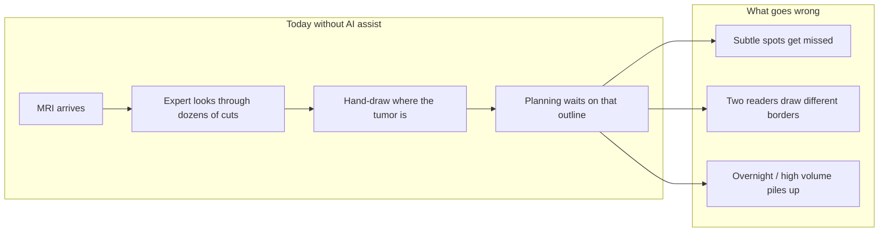
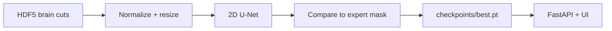

# Neuro

**Precision that heals — faded green, focused care.**

[](https://www.python.org/)
[](https://pytorch.org/)
[](https://monai.io/)
[](https://fastapi.tiangolo.com/)
[](LICENSE)

> I built Neuro so a computer can help spot brain tumors on MRI — then show a plain-English result in a simple web UI.

This repo is my research-to-demo pipeline: train a 2D segmentation model on BraTS slices, serve it with FastAPI, and review findings in the frontend.

---

## The problem I’m tackling

Brain MRI is packed with information, but **finding and outlining a tumor by hand is slow, tiring, and easy to miss on a busy day**. Specialists already know how to read scans; the bottleneck is time and consistency when every pixel of a lesion may matter for treatment planning.



| Pain | In plain language |
|------|-------------------|
| **Scale** | More scans than specialist hours |
| **Consistency** | Outlines differ person to person |
| **Latency** | Waiting on a careful contour delays care planning |
| **Coverage** | Not every site has a neuro expert at 2 a.m. |

**What Neuro does about it:** I train a model to paint “look here” on each 2D cut of a multi-sequence MRI, then expose that as an API + UI so a human can still decide — the AI is an assistant, not a doctor.

See also [OR comparison](docs/or-comparison.md) and the [case study](docs/case-study.md).

---

## Where the data came from

I use public **BraTS 2020** brain-tumor MRI data, packaged on Kaggle as ready-made 2D slices:

| Item | Detail |
|------|--------|
| **Source** | [awsaf49/brats2020-training-data](https://www.kaggle.com/datasets/awsaf49/brats2020-training-data) on Kaggle |
| **Origin** | BraTS 2020 challenge — multi-institution pre-op MRI (gliomas), expert-approved labels |
| **What I downloaded** | Per-slice **HDF5** files (`volume_*_slice_*.h5`) + metadata CSV |
| **What’s in each file** | 4 MRI channels (T1, T1ce, T2, FLAIR) + a tumor label mask |
| **On disk here** | `data/brats2020/` (gitignored; ~57k slices after unzip) |
| **How I pulled it** | Kaggle API with a `KGAT` token (`scripts/download_brats.py`) |

Labels mark tumor-related tissue (core / edema / enhancing-style regions). Mid-stack slices usually have tumor; top/bottom cuts are often clear — I documented demo picks in [TESTS.md](TESTS.md).

---

## How I trained it

I teach a **2D U-Net** (MONAI + PyTorch) to map each MRI cut → a colored map of “normal” vs “suspicious” pixels.



| Step | What I did |
|------|------------|
| **Model** | MONAI `UNet`, 4 input channels → 4 output classes |
| **Loss** | Cross-entropy vs the labeled mask |
| **Metric** | Dice score on a held-out patient split (no slice leakage across patients) |
| **Config** | [`configs/brats2d_unet.yaml`](configs/brats2d_unet.yaml) — CPU-friendly (e.g. 64×64, small patient subset) |
| **Scripts** | `scripts/train.py`, `scripts/evaluate.py` |
| **First smoke run** | Tiny **synthetic** HDF5 pack so the loop worked before Kaggle finished |
| **Real data** | Same scripts pointed at `data/brats2020/` once the BraTS pack was on disk |

Honest note for demos: if `checkpoints/best.pt` is still from the synthetic smoke train, overlays on real BraTS will be weak. I retrain on real patients when I want a sharper pitch:

```bash
source .venv/bin/activate
python scripts/train.py --epochs 5 --max-patients 8
python scripts/evaluate.py
```

---

## Docs

| Document | What it covers |
|----------|----------------|
| [Technical Architecture](docs/architecture.md) | Pipeline, models, imaging stack, FastAPI serving, metrics |
| [Case Study](docs/case-study.md) | Problem, audience, and product framing |
| [OR comparison](docs/or-comparison.md) | Manual vs AI outline in a normal OR |
| [Development log](docs/dev-log.md) | Sprint notes and milestones |
| [Blog: Teaching the computer to see](docs/blog/teaching-the-computer-to-see.md) | Narrative of what I built |
| [TESTS](TESTS.md) | Which `.h5` scans show tumor vs clear |

---

## Tech stack

| Component     | Technology |
|---------------|------------|
| Deep Learning | PyTorch 2.x + MONAI |
| Data          | BraTS 2020 HDF5 slices (Kaggle `awsaf49/brats2020-training-data`) |
| Training      | 2D U-Net, CPU-friendly configs |
| API           | FastAPI |
| Packaging     | [uv](https://docs.astral.sh/uv/) |
| Frontend      | Vite + React (**pnpm**) |

**Python:** `>=3.10,<3.13` — I use **3.12** (PyTorch wheels don’t support 3.13+ yet).

---

## Quick start

### Prerequisites

- Python **3.12** via [uv](https://docs.astral.sh/uv/)
- BraTS data under `data/brats2020/` (or run `scripts/download_brats.py` with `KAGGLE_API_TOKEN`)

### Environment

```bash
uv venv --python 3.12
source .venv/bin/activate

# If /tmp is small:
# export TMPDIR=$HOME/.cache/uv-tmp UV_CACHE_DIR=$HOME/.cache/uv

uv pip install torch torchvision --index-url https://download.pytorch.org/whl/cpu
uv pip install -e .
```

### Train / evaluate

```bash
python scripts/train.py --epochs 2 --max-patients 4
python scripts/evaluate.py
```

### API + UI

```bash
# Terminal A
uvicorn api.main:app --reload --host 0.0.0.0 --port 8000

# Terminal B
cd frontend && pnpm install && pnpm dev
```

Open http://localhost:5173 — drop a brain-scan `.h5` and check for a tumor. Demo file picks: [TESTS.md](TESTS.md).

---

## License

Apache 2.0 — see [LICENSE](LICENSE).
