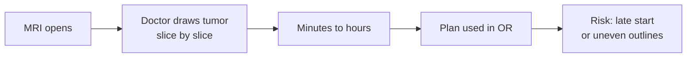
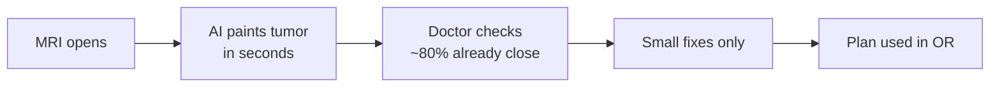
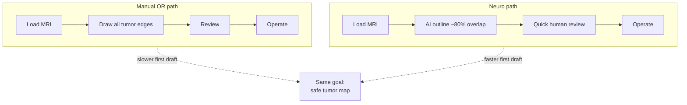

# OR workflow: manual vs Neuro

Simple compare-and-contrast for how a tumor outline gets onto the screen before surgery.

**Bottom line:** the AI draft is faster and more consistent than drawing every slice by hand. A surgeon still reviews it. This is an assist, not a replacement.

---

## What we measured (smoke train)

| Signal | Result | Plain meaning |
|--------|--------|----------------|
| Patients | 8 | Small practice set |
| Best tumor overlap (Dice) | **0.80** | About **4/5** of the tumor matched the doctor outline |
| Best checkpoint | Epoch 1 | First good map was kept |
| Time per full pass | ~1 minute | Train + quiz on this subset |

In a normal OR, that map is a **starting outline** the team can check and tweak — not the final call by itself.

---

## Normal OR today (manual)

Someone opens the MRI, paints tumor on slice after slice, then the team uses that plan in the room.

**Pain in the room**

- Slow when many slices need a line
- Two doctors may draw slightly different edges
- Waiting on the outline can delay the next step

---

## With Neuro (assist)

The model paints a first pass. The team checks the edges, then goes.

**Why this is better and more efficient**

| | Manual | Neuro |
|--|--------|----------------|
| First outline | Person draws everything | Computer drafts it |
| Time to first map | Long | Short |
| Consistency | Changes by reader | Same model, same rules |
| Doctor role | Draw + decide | Check + decide |
| OR fit | Waiting on hand work | Faster path to a usable plan |

You still need a human eyes-on check. The win is **less drawing time** and a **steadier first draft**.

---

## Side by side

---

## Honest scope

- **Better for:** getting a usable outline onto the screen quickly, then refining.
- **Efficient for:** cutting repetitive slice-by-slice drawing.
- **Not yet:** a fully autonomous OR tool. More patients, 3D volumes, and site validation come next.

Tagline stays the same: **Precision that heals — faded green, focused care.**
